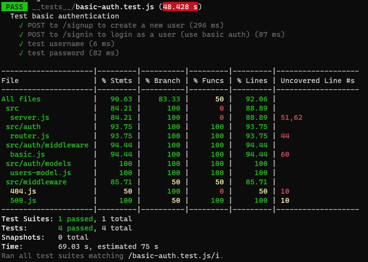

# basic-auth

## [Deployed App](https://basic-auth-wafa.herokuapp.com/)

Authentication System Phase 1: Deploy an Express server that implements Basic Authentication, with signup and signin capabilities, using a Mongo database for storage.

✓  Make a POST request to the /signin route

✓  Send a basic authentication header with a properly encoded username and password combination

✓  On a successful account login, return a 200 status with the user object in the body

✓  On any error, trigger your error handler with the message “Invalid Login”

## authentication related files in ==> auth folder

✓ Extract the authentication logic for /signin as middleware

✓ Extract the mongo/schema into a separate module

✓ Create a module to house all of routes for the authentication system.

- Create a POST route for /signup

- Create a POST route for /signin

```
├── .gitignore
├── .eslintrc.json
├── __tests__
│   ├── auth.router.test.js
│   ├── basic-auth.test.js
│   ├── bearer-auth.test.js
│   ├── 500.test.js
│   ├── model-finder.test.js
│   ├── mongo.js
├── src
│   ├── auth
│   │   ├── router.js
│   │   ├── middleware
│   │   │   ├── basic.js
│   │   │   ├── bearer.js
│   │   │   ├── oauth.js
│   │   ├── models
│   │   │   ├── users-model.js
│   ├── middleware
│   │   ├── 404.js
│   │   ├── 500.js
│   │   ├── model-finder.js
│   ├── server.js
├── index.js
└── package.json
```

## Testing

✓ POST to /signup to create a new user

✓ POST to /signin to login as a user (use basic auth)

✓ Need tests for auth middleware and the routes



## Dependencies 

- Express

- Dotenv

- Jest

- Morgan

- Bcrypt

- Mongoose

- Cors

- @code-fellows/supergoose


[PULL REQUEST (1) ](https://github.com/wafaankoush99/basic-auth/pull/1)


